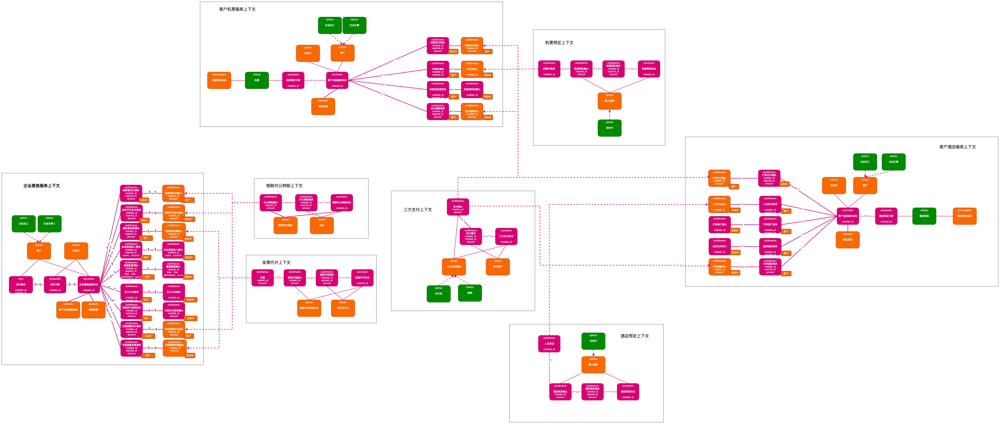
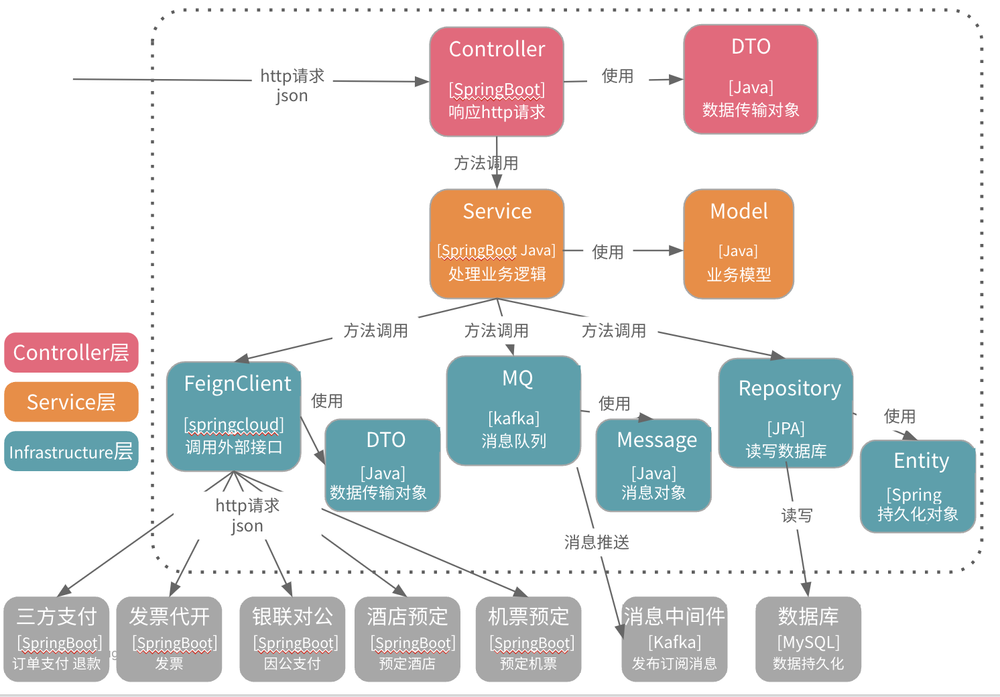

# 企业差旅服务

## 业务介绍

- 任你行 希望开发⼀套数字化平台来⽀持其业务运营，实现业务线上化：
    - ⾯向中⼩企业客⼾提供差旅预订与管理服务
    - 管理⼈员可以在平台中完成企业配置、差旅管理、财务结算等。
    - 出⾏⼈员可以使⽤任你⾏进⾏机票和酒店服务的预订。

    - 现有主要业务场景：
      -企业管理人员可进行差旅配置，并且进行因公审批，月度支付报表和服务费结算支付同时开具发票
    - 员工认证信息后，在线预定酒店和机票，支持因公因私支付，可以酒店退订和退房，机票退改签和订单查看评价
    - 任你行为企业录入信息和生产月度支付报表，为员工提供酒店和机票信息并且支持在线预定创建订单、退订或改签，支持因公因私支付，开具发票等等

## 业务建模

## 架构设计

- Controller层
    - 负责接口uri，接收请求，调用service，使用DTO传输数据

- Service层
    - 负责业务逻辑实现，调用infrastructure，使用Model传输数据

    - Infrastructure层，负责与外部系统和中间件交互实现
        - 组件 FeignClient：提供三方系统调用
        - 组件 MQ：提供消息发布订阅
        - 组件 Repository：提供数据持久化

